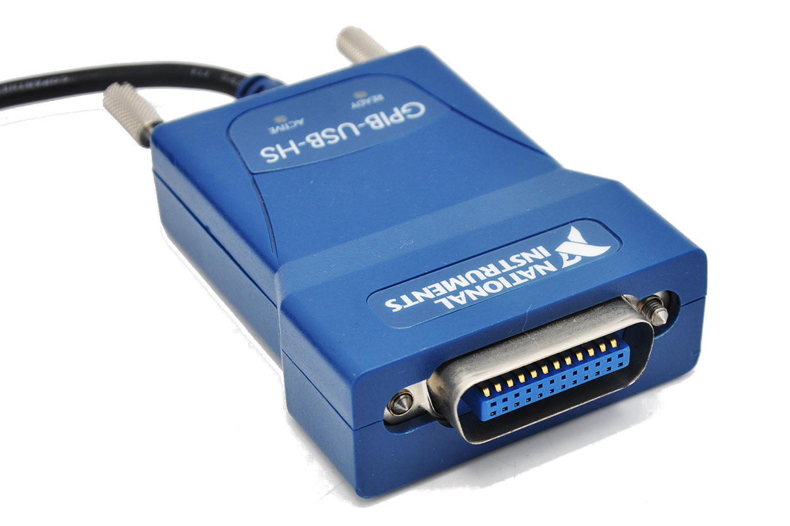

# Current Sweeping - Voltage Sensing (Keithley 2400)

This directory contains Python automation scripts for performing **V-I Characterization** (Current Sweeps while sensing Voltage) using a **Keithley 2400 SourceMeter**.

This method is particularly useful for measuring low-resistance samples or characterizing devices where precise current control is required to avoid thermal runaway.

<p align="center">
  
  &nbsp;&nbsp;&nbsp;&nbsp;
  
  <br>
  <em>Figure 1: Keithley 2400 (Left) and National Instruments GPIB-USB-HS Interface (Right) </em>
</p>

## 🚀 Features

* **Bi-Directional Sweeping:** Automatically performs a $0A \rightarrow -I_{min} \rightarrow +I_{max} \rightarrow 0A$ loop.
* **Live Plotting:** Real-time visualization of the V-I curve using `pyqtgraph`.
* **Safety Ramping:** If interrupted, the script automatically ramps the current back to $0A$ to prevent inductive kicks or sample damage.
* **Automated Export:** Saves data as a timestamped `.txt` (TSV) file and exports the final plot as a `.png`.
* **Scientific Notation:** Y-axis (Voltage) is automatically formatted for high-precision readings.

---

## 💾 Requirements

### a. Linux Requirements 🐧

This script is designed for **Linux**. You must use the open-source **linux-gpib** driver.
👉 [Detailed Linux-GPIB Installation Guide](https://github.com/ocakiroglu/lab_device_control/blob/main/I_sweep_V_sense/Keithley_2400/install_linux_gpib.md)

### b. Python Dependencies 🐍

```bash
pip install numpy pyqtgraph PyQt5

```

### c. Permission 🔑

Grant access to the GPIB interface (required after every reboot/plug-in):

```bash
sudo chmod 666 /dev/gpib0

```

---

## 🛠 Configuration

Before running the script, open `test_keithley_VI.py` and adjust the parameters in the **Main Program** section:

| Parameter | Description |
| --- | --- |
| `keithley_address` | The GPIB address of the Keithley 2400 (Default 24) |
| `min_current` | The negative peak (minimum current) of the sweep in Amperes |
| `max_current` | The positive peak (maximum current) of the sweep in Amperes |
| `step_current` | The current increment/decrement between measurements |
| `volt_comp` | **Voltage Compliance:** The safety voltage limit to protect the sample |
| `volt_range` | The fixed measurement range for the voltmeter |
| `file_suffix` | Custom tag for your filename (e.g., "contact-B-C") |

---

## 📈 Usage

Run the script from the terminal:

```bash
python3 test_keithley_VI.py

```
or with any IDE (eg: VS Code or Spyder) directly.

1. **Visuals:** The "Forward" sweep is marked in **Red**, and the "Backward" sweep in **Blue**.
2. **Live Updates:** If `verbose` is set to `True`, real-time readings will print to the terminal.
3. **Data:** Files are saved with the prefix `current_sweep_data_[timestamp]`.
4. **Inspection:** Once the sweep ends, use the **Green Crosshair** to hover over data points and see precise $V$ and $I$ values.

## ⚠️ Safety Note

This script operates in **Current Source Mode**. Ensure your **Voltage Compliance** (`volt_comp`) is set to a safe value for your specific device. The script will attempt to ramp the current to zero during a `KeyboardInterrupt` or unexpected error.

## 🙏 Acknowledgments

* **Code Assistance:** Developed with the support of **GitHub Copilot**.
* **Institutional Support:** Developed at the **Universidad Complutense de Madrid (UCM)**.
