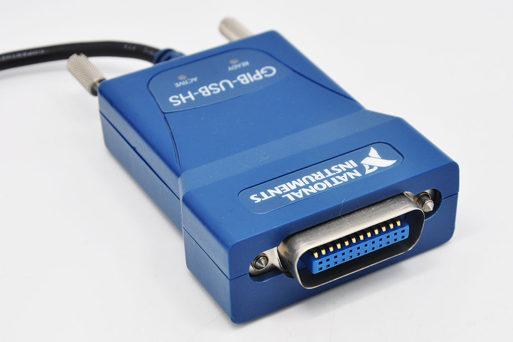

# Voltage Sweeping - Current Sensing (Keithley 2400)

This directory contains Python automation scripts for performing **I-V Characterization** (Voltage Sweeps while sensing Current) using a **Keithley 2400 SourceMeter**.

The script provides a real-time visual interface for monitoring the sweep and automatically handles data logging and safety procedures.

## 🚀 Features

* **Bi-Directional Sweeping:** Automatically performs a $0V \rightarrow -V_{max} \rightarrow +V_{max} \rightarrow 0V$ loop.
* **Live Plotting:** Uses `pyqtgraph` for high-performance, real-time data visualization.
* **Safety Ramping:** If the script is interrupted (Ctrl+C) or hits an error, it automatically ramps the voltage back to $0V$ to protect your equipment and sample.
* **Automated Export:** Saves data as a timestamped `.txt` (TSV) file and exports the final plot as a `.png`.
* **Interactive Inspection:** Includes a crosshair tool to inspect specific data points on the plot after the sweep.

---
## 💾 Requirements

###  a. Linux Requirements 🐧



This script is designed for **Linux** environments. Because National Instruments (NI) does not officially support the **GPIB-USB-HS** interface on modern Linux distributions, you must use the open-source **linux-gpib** driver.

#### 1. System Dependencies

Initially, you must install the following build tools and dependencies to compile the drivers:

```bash
sudo apt install build-essential texinfo texi2html libcwidget-dev libncurses5-dev \
libx11-dev binutils-dev bison flex libusb-1.0-0 libusb-dev libmpfr-dev \
libexpat1-dev tofrodos subversion autoconf automake libtool byacc gedit

```

#### 2. Driver Installation (Kernel & User-space)

You cannot simply use `apt-get install`. You must download the `linux-gpib-4.3.6` source and install it at a low-level:

* **User-space:** Build the libraries that allow Python to control the Keithley.


* **Kernel:** Build and install the driver modules.


* **Module Activation:** Load the driver using `sudo modprobe ni_usb_gpib`.


#### 3. Configuration & Permissions

* **GPIB Config:** You must edit `/etc/gpib.conf` to set `board_type = "ni_usb_b"` and set the Keithley's primary address (PAD) to `24`.


* **USB Permissions:** To run the script without `sudo`, you must grant read/write permissions to the device:
```bash
sudo chmod 666 /dev/gpib0
```


#### 4. Python Integration

The `gpib` module must be installed into your **global Linux Python** environment, as it is often not accessible within virtual environments (Conda/venv).

```bash
cd ~/linux-gpib-4.3.6/linux-gpib-user-4.3.6/language/python
sudo python ./setup.py install
```


#### 📚 References
* **Primary Guide:** [Step-by-step guide: How to use GPIB with Raspberry Pi/Linux](https://community.element14.com/members-area/personalblogs/b/blog/posts/step-by-step-guide-how-to-use-gpib-with-raspberry-pi-linux)
* **NI Support:** [Discussion on GPIB-USB-HS and Visa under Linux](https://forums.ni.com/t5/Instrument-Control-GPIB-Serial/What-setup-to-use-for-GPIB-USB-HS-and-Visa-under-Linux/m-p/2110182#M55089)
* **Source Code:** [Linux-GPIB SourceForge Repository](https://sourceforge.net/p/linux-gpib/git/ci/master/tree/)
* **Linux-GPIB Files:** [Linux GPIB SourceForge Files](https://sourceforge.net/projects/linux-gpib/files/linux-gpib%20for%203.x.x%20and%202.6.x%20kernels/)


### b. Python Dependencies 🐍

Install the required Python packages via `pip`:

```bash
pip install numpy pyqtgraph PyQt5

```

> **Note:** Although there is no `import pyqt5` directly in the script, having `pyqtgraph` requires a Qt backend like `PyQt5`.

---

### c. Permission 🔑

By default, Linux restricts access to the GPIB interface. You must run the following command every time you plug in the device or restart your computer to grant the necessary permissions:

```bash
sudo chmod 666 /dev/gpib0

```

---

## 🛠 Configuration

Before running the script, open `test_keithley_IV_v6.py` and adjust the parameters in the **Main Program** section:

| Parameter | Description |
| --- | --- |
| `keithley_address` | The GPIB address of the Keithley 2400 (Default 24) |
| `start_voltage` | The negative peak (minimum voltage) of the sweep |
| `stop_voltage` | The positive peak (maximum voltage) of the sweep |
| `step_voltage` | The voltage increment/decrement between measurements |
| `curr_comp` | Current compliance: The safety limit to prevent sample damage |
| `curr_range` | The fixed measurement range for the ammeter |

---

## 📈 Usage

Run the script from the terminal:

```bash
python3 test_keithley_IV_v6.py

```

1. A window will appear showing the live I-V curve.
2. The "Forward" sweep is marked in **Red**, and the "Backward" sweep in **Blue**.
3. Once finished, the script will save a `.txt` file and a `.png` image in the same directory.
4. **Interactive Mode:** After the sweep, move your mouse over the plot to see specific Voltage and Current values.

## ⚠️ Safety Note

The script includes a `finally` block that ensures the SourceMeter output is disabled and the voltage is set to $0V$ upon exit. **Do not manually power off the Keithley while the output is ON unless in an emergency.**
